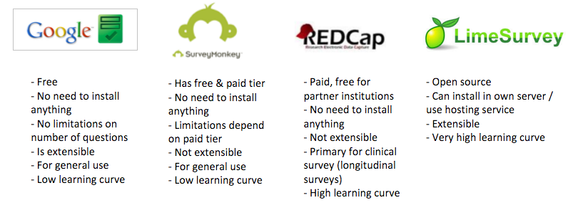
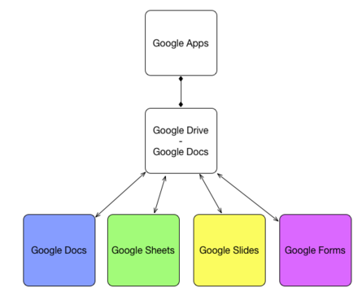

### Why web survey ?

As a researcher, you will want to work with data. However, before you work with data, first you have to get the data first
Imagine you are a social researcher that currently doing research about the general public preference regarding what kind of drinks that they like.

You decided to do a survey and want to find a *cost efficient* and *effective way* to reach *as many people as possible*

### Type of survey tools

| Web based survey tools                                             | Mobile based survey tools                        |
|--------------------------------------------------------------------|--------------------------------------------------|
| Always online (need internet)                                      | Can be used offline & online                     |
| Open in a web browser (Chrome, Internet Explorer, Mozilla Firefox) | Has a dedicated mobile app                       |
| Used to get text and choices data                                  | Used to get location, photo, and video data      |
| Distributed via email link                                         | Distributed via link but open using mobile phone |

### Different kind of web survey tools

### What is Google Forms ?

Google Forms is a part of the Google apps suite, specifically for creating web based form.

Google Form is free and there are no limitations in the number of questions / respondent that you can have. It also can took up huge amount of data, about 2+ million cells in the spreadsheet.
Data that you can get from Google Forms automatically turned into a spreadsheet in Google Sheets. It has a low learning curve and is extensible using Google Script or using Add Ons.

### How to access Google Forms

To access Google Forms, you will need to have a Google Account. 
If you have Youtube, Google Play, Gmail, Google+ or Google Docs account, you already have a Google Account
If not you can sign up here [Google Account signup](https://accounts.google.com/signup)

Next: [Basic form creation using Google Form](google-forms-02-creation.html)

Prev: [Google Forms overview](google-forms-00-overview.html)

[Main menu](index.html)
