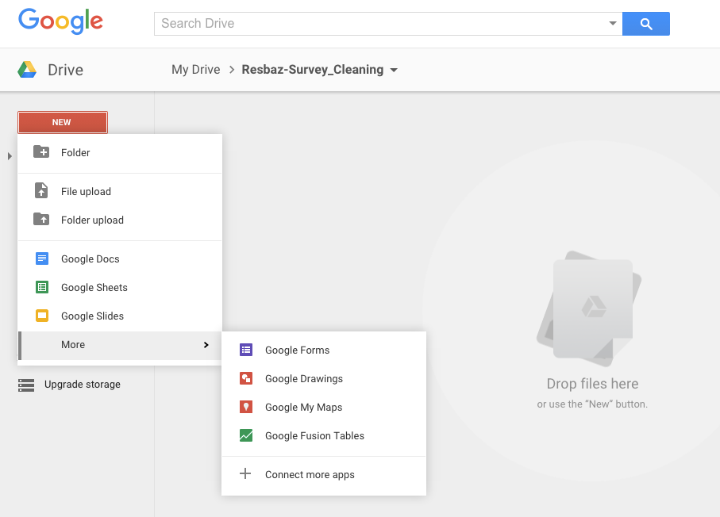
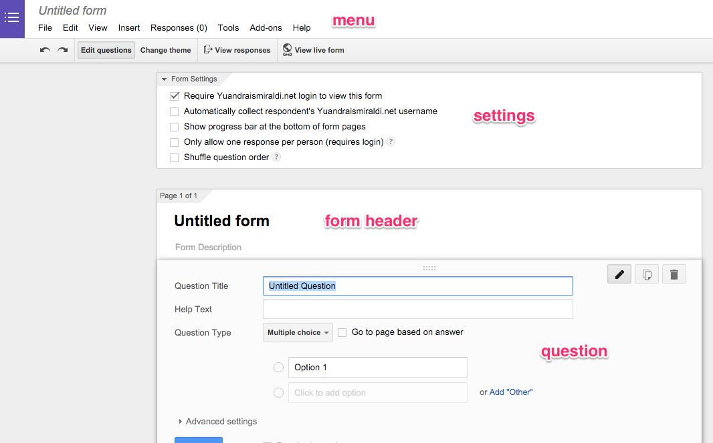

### Create a new Google Form

You create a new Google Form via Google Drive interface.

- login to your Google Drive account [Google Drive](http://drive.google.com)
- Click on red "new" button in top left
- Click on "more" button
- Click on Google Form

Congratulations ! You have made your first Google Form !

### Google Form Interface

The Google form interface is separated into 4 main area :

- the menu bar
- the form settings bar
- the form header bar
- the form question area

The main area here that we will working on is the form question area

### Adding a question

Google forms has many question types

- Text: Respondents provide short answers
- Paragraph text: Respondents provide longer answers
- Multiple choice: Respondents select one option from among several
- Checkboxes: Respondents select as many options as they'd like
- Choose from a list: Respondents select one option from a dropdown menu
- Scale: Respondents rank something along a scale of numbers (e.g., from 1 to 5)
- Grid: Respondents select a point from a two-dimensional grid
- Date: Respondents use a calendar picker to enter a date
- Time: Respondents select a time (either a time of day or a duration of time)

Let's make a form !

For example, we are a researcher that want to research about people preference. We want to do a study on the perceptions people have towards individuals wearing glasses  vs contact lenses based on first impressions and also the decision factors for choosing to wear either.

Make a new title for the form :

- click on add Title and Description
- change it to "Glasses vs Contact Lens"

Adding a question :

- click on add question in the right
- set the type of the question by clicking on question type
- add the question details like title and hint

### Viewing the form

After you've edit the question, click on the view live form in the top right

Your google form will be shown 

Try filling it out !

After you fill it, go back to your form editing page, and click on view responses.

You will see the data that you've just put in. Now you see that it is very easy for you to get the data out from google forms.
Congratulations ! You have created your first google form !

### Exercise

Add more questions to the form !

- Add multiple questions to determine between contact lens and glasses
- Try multiple questions type such as scale and grid

Next: [Theming in Google Form](google-forms-03-theming.html)

Prev: [Introduction to Google Forms](google-forms-01-intro.html)

[Main menu](index.html)
