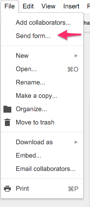
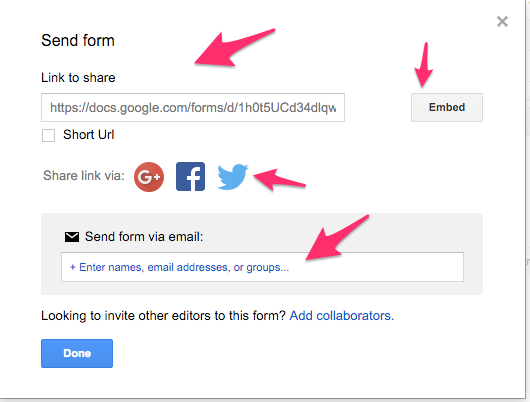
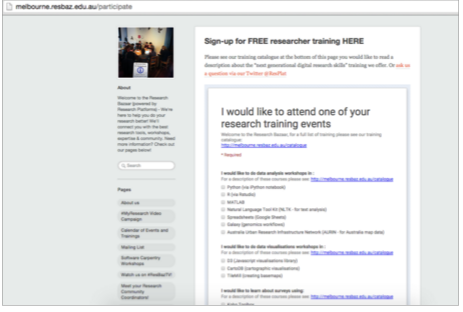

### Distributing Google Forms

There are four ways to distribute a Google Form and everything can be accessed from a single main menu

- click on File
- click on send form



You will then see 4 ways to distribute Google Form 



1. By web address

This is the most common way. Google will give you the web address for you to copy and then send it to other people.

2. By embedding

You will get a script of html code and put it inside a web page.

you will see something like this :



3. By sending via social media

Google will share the link via social media such as G+ and twitter

4. By sending the link via email

Just put the email of people you want the form to be send to and Google will send the form via email


### Exercise

Let's try embedding the script on a simple web page

- Using your text editor, create a new file
- make a structure like this 

```
    
    <html>
    
    <head>
    </head>
    
    <body>
    </body>
    
    </html>


- copy the emmbedded form code to between the <body> </body>


```
    
    <html>
    
    <head>
    </head>
    
    <body>
        your embedded code here
    </body>
    
    </html>

- save the file as test.html
- double click on the file so you can open it in a web browser

Next: [Collaboration in Google Form](google-forms-06-collaboration.html)

Prev: [Conditionality to Google Forms](google-forms-04-conditionality.html)


[Main menu](index.html)
