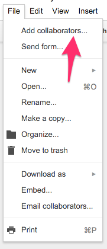
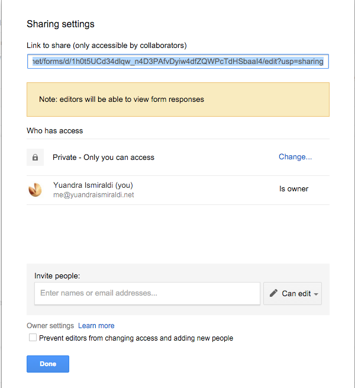

### Collaboration with Google Forms

Google forms allow you to collaborate with each other

- you can share the data file (google sheets)
- or you can share the form design (google form)
- sharing the google form design also shares the data

How to start collaboration

- click on file
- click on add collaborators

There are two ways to add collaborators 

- by sending the link

Google form provide a link that you can copy paste to the other people.
However you will need to set up permission for the link first by clicking "change" in the permission dialog

- by sending via email

If you put the email address of people you want to collaborate with, google forms will auto add them to your form

###Exercise

- set your sharing permission to public
- copy and paste the link to the etherpad

Next: [Validation in Google Form](google-forms-07-validation.html)

Prev: [Distributing Google Forms](google-forms-05-distributing.html)

[Main menu](index.html)
