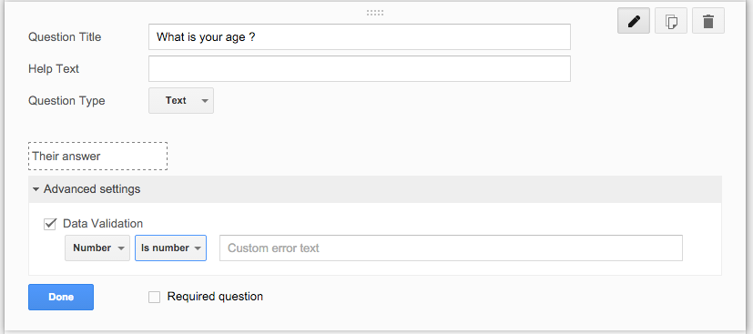

### Validation with Google Forms

Google Forms allows you help to get a better data from your from by two ways :

- implementing validation in the google form question
- implementing prefilled form

### Putting validation in Google Form question

- click on "what is your age ?" question
- click on "advanced settings"
- mark the data validation to enable it
- set it to only accept number

### Exercise

- create a question text "what is your name ?"
- set validation so is only accept character

### Challenge

Google form supports using a pattern defining language that is regular expression.

- make a question text "what is your email ?"
- using regular expression, try to validate the email
- use tools like [Regexr](http://regexr.com/) to help reference the regular expression syntax
- use a simple email pattern for email such as : researchbazaar@gmail.com
- the pattern : (any character expect blank) (a @ symbol) (any character expect blank) (a . symbol) (any character expect blank)

### Using prefilled form

Google form allows you to have prefilled form to give your respondent a default answer

- click on responses
- click on prefilled URL
- make your way throught the forn, making the default answer
- in the end you will got your pre-filled url form

###Exercise

- prefilled your form
- copy and paste the link to the etherpad

Next: [Extending Google Form](google-forms-08-extending.html)

Prev: [Collaboration in Google Forms](google-forms-06-collaboration.html)

[Main menu](index.html)
