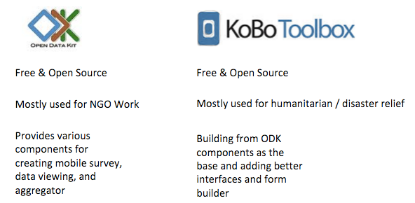
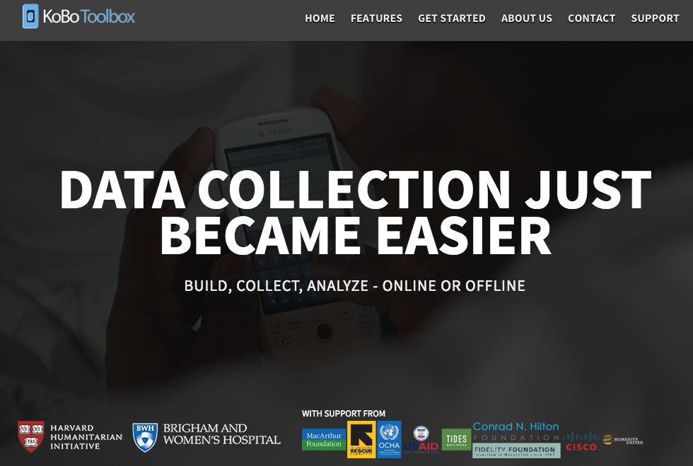

### Why mobile data collection ?

Imagine that you are an architect that is doing research regarding modern & traditional buildings.
You have to go to urban and rural places to collect data, take photos & videos, and get the location of the buildings.
You expect to go to the densest of cities and the sparsest of village where there is no internet and no cell phone signal.

We see the keywords : *photos*, *videos* , *location*, *offline*

Remembering the benefit of the mobile data collection vs the web based survey tools [here](google-forms-01-intro.html), we can see that mobile data collection can get that benefits.

- can be used offline & online
- has a dedicated mobile app
- used to get location, photo, and video data

### Example of different kind of mobile data collection

### What is Kobo Toolbox ?

Kobo Toolbox is a fork project of the Open Data Kit that is used mostly for humanitarian relief.
It was developed by the harvard humanitarian initiative and further supported by United Nations Office for Coordinating Humanitarian Affaris (UN-OCHA).
It is free to use and open source

Kobo Toolbox is separated into 3 main components :

- KoboForm : for form creation
- KoboCat : for form deployment
- Enketo : for form viewer

### Benefit & Features of Kobo Toolbox

- free to use & open source
- Create reusable form that can be downloaded to mobile devices
- Support offline data capture
- Can get location, photo, videos, sound data
- Provide data analysis platform
- All data is downloadable
- Extensible

### How to access Kobo Toolbox

To access Kobo Toolbox , you will need to have a Kobo Toolbox Account for the public use
Sign up for the account here : [Kobo Toolbox Signup](http://kf.kobotoolbox.org)

Next: [Basic form creation using Kobo Toolbox](kobo-toolbox-02-creation.html)

Prev: [Kobo Toolbox Overview](kobo-toolbox-00-overview.html)

[Main menu](index.html)
