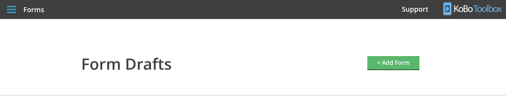
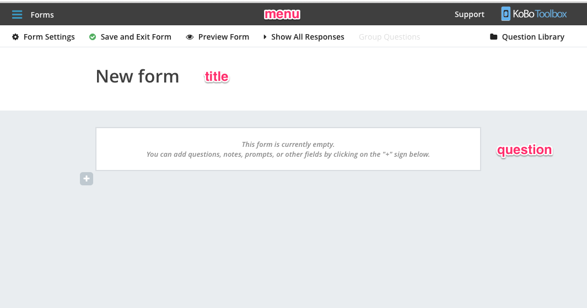
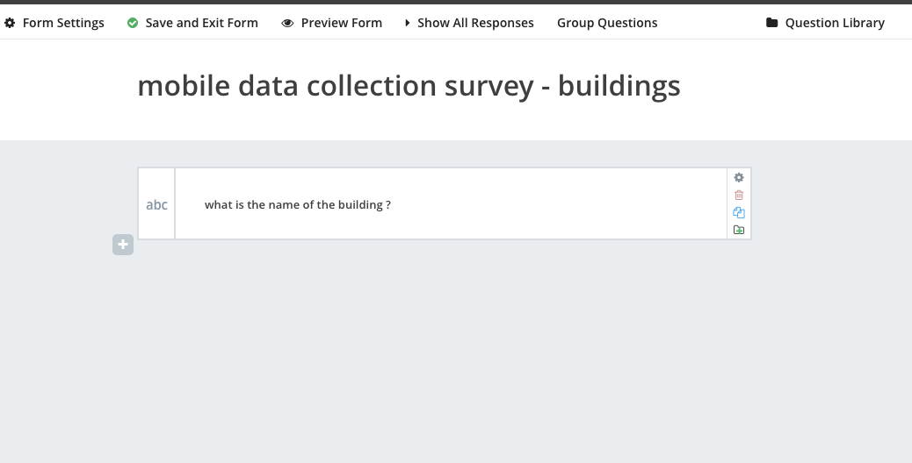
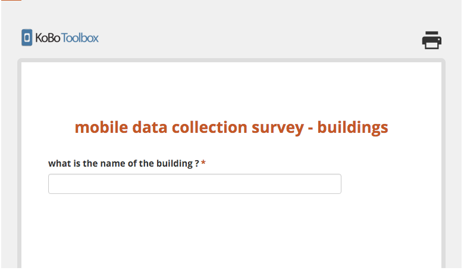
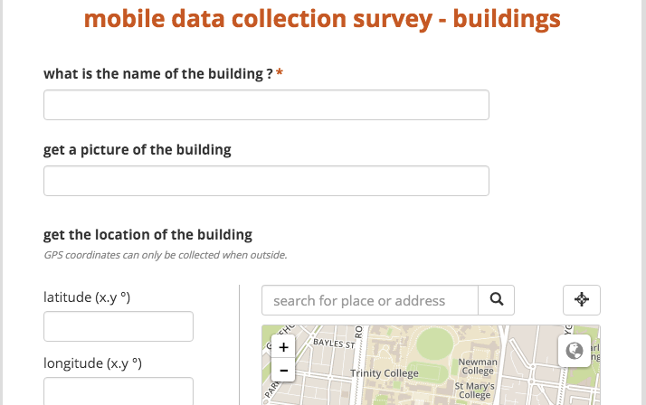

### Create a new Kobo Toolbox Form

You create a new Kobo Toolbox Form via the Kobo Toolbox interface.

- login to your Kobo Toolbox account [Kobo Toolbox](http://kf.kobotoolbox.org)
- Go to the form section (make sure it shows Forms in the top left)
- Click on the add form button

Congratulations ! You have made your first Kobo Toolbox  !

### Kobo Toolbox Form Interface

The Kobo Toolbox form interface is separated into 3 main area :

- the menu bar
- the form title bar
- the form question area

The main area here that we will working on is the form question area

### Adding a question

Kobo toolbox has many question types, more than google form has

First, let us change the form header

- click on the form title area
- change it to "mobile data collection survey - buildings"

Second, let's create a question to ask for the name of the building.

- click on the + sign button
- type the name of the question "what is the name of the building ?"
- set the question type to text

It should look like this :

### Viewing the form

After you've edit the question, click on the preview form in the top

Your form will be shown :

Now save and exit the form.

Congratulations ! You have created your first Kobo Toolbox form !

### Exercise

Add more questions to the form !

- Add a image question "get a picture of the building"
- Ada a gps "get the location of the building"
- note : make sure to set both of them as non-required (to avoid having issues of GPS problem later on)

Next: [Distributing form using Kobo Toolbox](kobo-toolbox-03-distribution.html)

Prev: [Kobo Toolbox Overview](kobo-toolbox-01-intro.html)

[Main menu](index.html)
