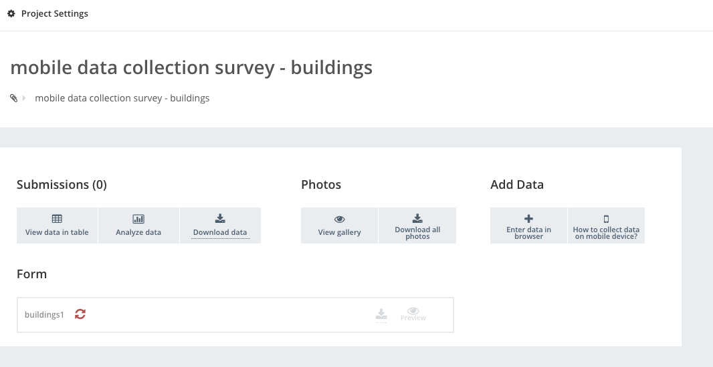
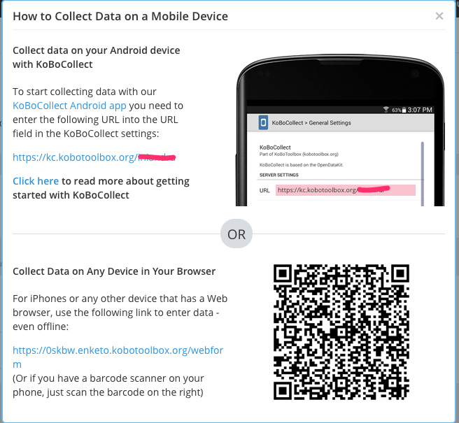
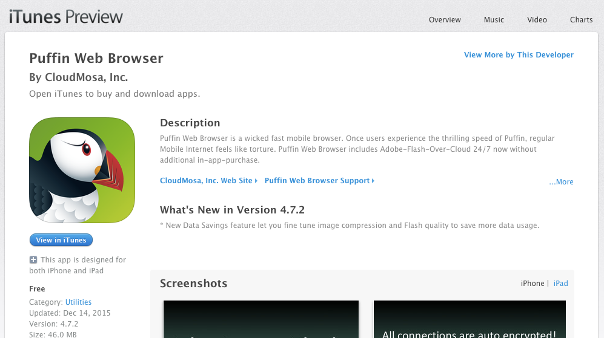
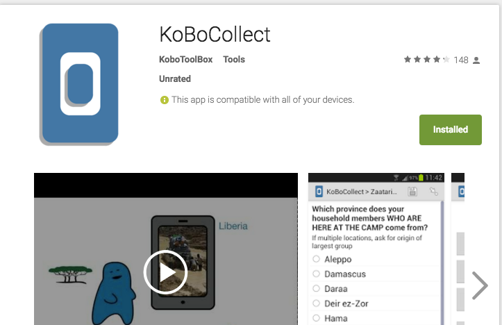
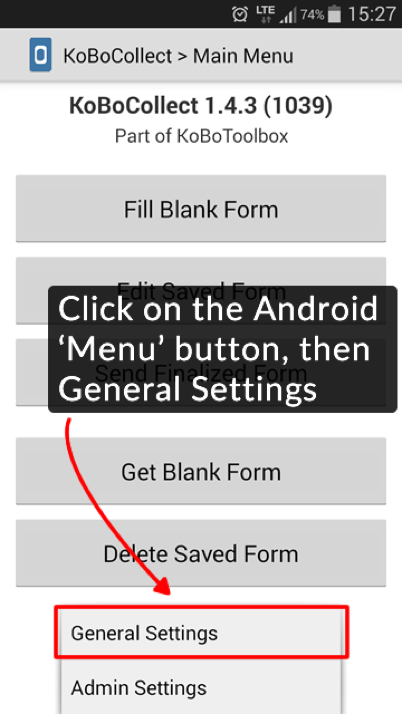
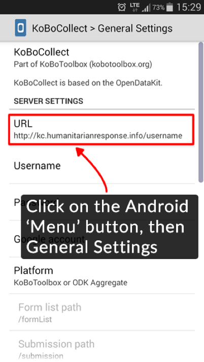
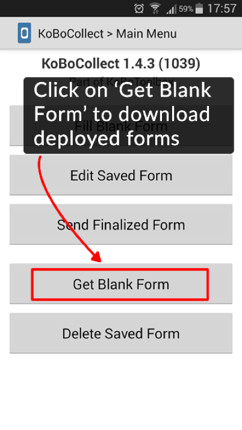
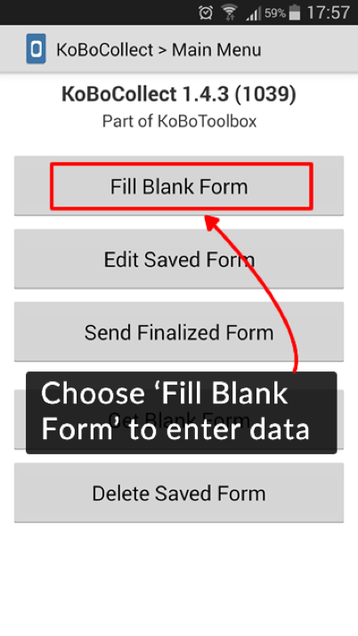
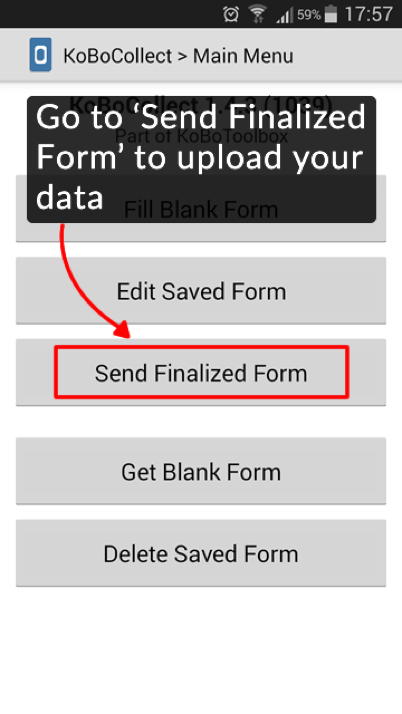

### Distributing form using Kobo Toolbox

To distribute the form you create there are several steps :

- deploy a project that uses the form
- open the form in our preferred platform (web, android, iOS)

### Deploying a project

- make sure you are in the form screen, where you can see a list of form in kobo toolbox
- hover on top of the form you wish to deploy and click the button deploy as a new project
- enter the new title and project id that you wish
- click deploy and view project

You will then be taken to the project screen. This will be your main area to deploy, view, and analyse the data of the form you created.

### Opening the form

To open and fill the form, there are several ways, you can open it from a computer and from mobile device.

#### Via web browser

To open the form via the computer, you will need to open it via the web browser. To be able to do so, you will need to get the web address of the form.

- in the project view, click on enter data via browser
- a new browser tab will open and allows you to enter data via web browser
- it is recommended that you use chrome
- the form address is the web address of the browser that you can share

#### Via mobile device

Kobo Toolbox provide a good instructions about how you can get the data via a mobile device

##### iOS

For iOS, you will need to download the Puffin Browser.
You can download it here : [https://itunes.apple.com/au/app/puffin-web-browser/id472937654?mt=8](https://itunes.apple.com/au/app/puffin-web-browser/id472937654?mt=8)

Note that the Puffin Browser has a few limitations :
- you can't upload pictures by taking them when you're filling the form. You have to get the picture first, saved the picture in camera roll, and then select the picture from the camera roll when you want to fill the form.
- GPS location might get blocked - this is usually permission error. Check your privacy settings.

##### Android

For Android, you can download a dedicated mobile client called the Kobo Collect.
You can download it here : [https://play.google.com/store/apps/details?id=org.koboc.collect.android&hl=en](https://play.google.com/store/apps/details?id=org.koboc.collect.android&hl=en)

How to use the Kobo Collect

- take note of your url (http://kf.kobotoolbox.org/your_username)
- in Kobo Collect, go to server settings

- enter the url in the settings

- back to main menu, pick get blank form and choose the form template you want to fill

- once it done, choose fill blank form to fill the form you just get

- send the filled form to server by clicking the send finalised form 

#### Via print

You can also print your form :

- open the form via a web browser
- click on the print icon to get a print friendly format of the form

### Exercise

- Pair up with the person beside you
- for 15 minutes, go outside the room and take data using your mobile phone
- get (picture+location data)

### Theming in Kobo Toolbox

Compared to Google Forms, Kobo Toolbox sadly does not offer much in the sense of theming. 

The build options that Kobo Toolbox has is when getting data from the web view, which only have the option to change the paging :

- single page view
- multiple page view

If you want to do more than that or want to modify how the form looks like on the mobile device then you'll have to fork the mobile client or make your own.

The other options that Kobo Toolbox has is groupings, that means you group questions with each other. 

To do that, select the question you want to be grouped, and select group question in the form design.

Next: [Conditionality in Kobo Toolbox](kobo-toolbox-04-conditionality.html)

Prev: [Basic form creation in Kobo Toolbox](kobo-toolbox-02-creation.html)

[Main menu](index.html)
