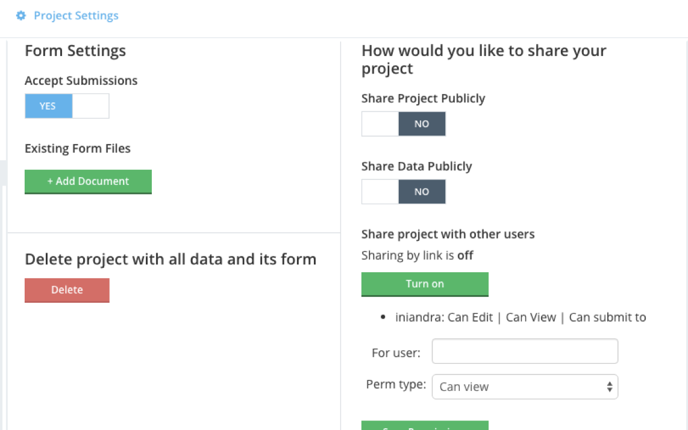

### Collaboration in Kobo Toolbox

Collaboration in the Kobo Toolbox means that you want to share your project.
You can share a specific project to other user in the same kobo toolbox server by selecting with project that you want to share with them. 
Afterwards, you can go to project settings and there you will find the project sharing option.
You can choose wether or not the people you share can also edit the project or only to get the data.

###Exercise

Share your project and share it to the etherpad

Next: [Data validation using Kobo Toolbox](kobo-toolbox-06-validation.html)

Prev: [Conditionality in Kobo Toolbox](kobo-toolbox-04-conditionality.html)

[Main menu](index.html)
