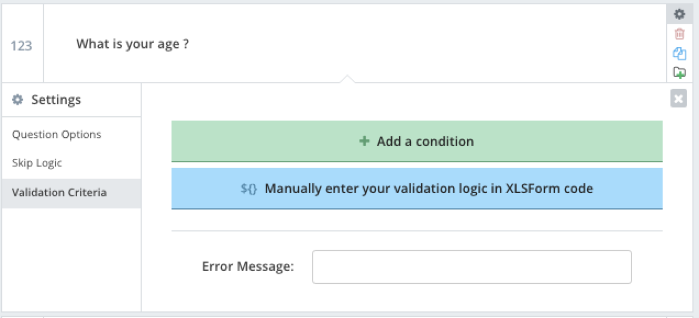
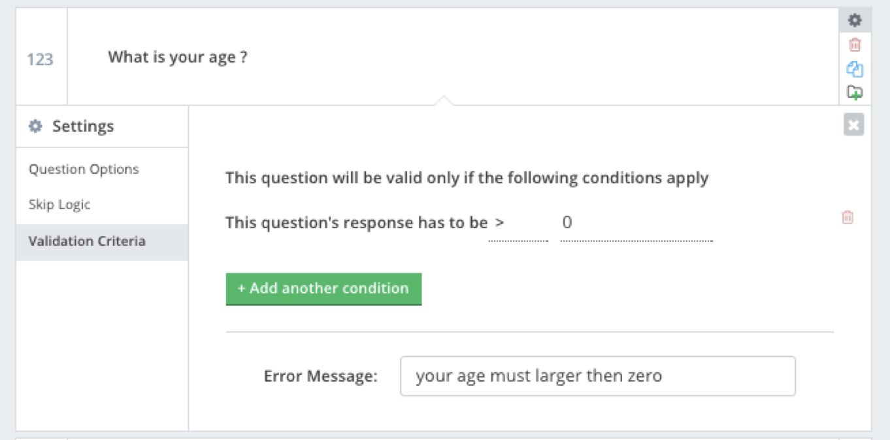

### Validation in Kobo Toolbox

Data validation in Kobo Toolbox is checking the value of the data entered into a specific value.

Let's try set up a validation.

- Choose a question, example "what is your age" question
- go to question settings, and choose validation criteria

- enter validation criteria for value to be more than 0

- enter the error message.

Try out the form. You will recieve an error message when you put a value less or equal to zero in the age.

###Exercise

We decided that we want to get people email addresses.

- make a question that ask "what is your email address"
- make a validation so the value of the email address must not be empty

Next: [Multi language form using Kobo Toolbox](kobo-toolbox-07-multilanguage.html)

Prev: [Collaboration in Kobo Toolbox](kobo-toolbox-05-conditionality.html)

[Main menu](index.html)
