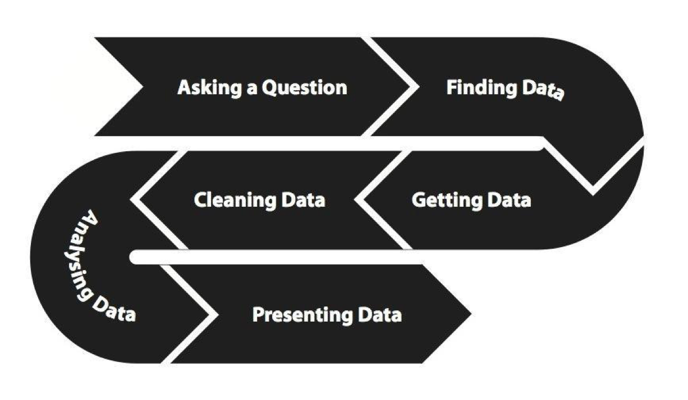

### What is messy data ?

We all work with data. However, some of us might not get the benefit of working with clean data, and end up working with messy data.

Dan Nguyen, ProPublica journalist, wrote in his tutorial about messy data [here](https://www.propublica.org/nerds/item/using-google-refine-for-data-cleaning) a description of messy data :

"Messy data” refers to data that’s riddled with inconsistencies, either because of human error or poorly designed record systems. So, a column that contains dates may hold values such as “12-10-2004”, “May 9, 1989”, and “12/4/10""

The main point of messy data is that we are working with data that has inconsistencies inside. Inconsistent condition such as :

- mistyped data
- duplicate data
- different measurement
- empty items
- wrong data format
- too much formatting
- and many more

### Why cleaning messy data is important ?

A diagram from the School of Data workflow on working with data shows that cleaning data is an integral part of working with data before we go to the analysis stage. Cleaning messy data is important because in order to get an accurate analysis, the input data that we insert to the analytics that we used have to be clean. Inconsistencies in the data would result in error in analysis or non-accurate analysis.

### What is data cleaning

Microsoft research described data cleaning as "Data cleaning is the process of detecting and correcting errors and inconsistencies in data” , As we know, messy data is data that has inconsistencies inside. However, the scope of data cleaning is usually larger than that, that is after cleaning up inconsistencies and errors, on the data cleaning phase we also end up to convert the data into something that our analysis tool will recognise. This means that we have to turn the data into a machine readable format that can be read by machines.

example of machine readable format that are open are :
- CSV : comma separated value, in which every value is separated by a comma
- TSV : tab separated value, in which every value is separated by a tab indentation

### Where open refine comes in 

Open refine (previously called Google Refine), is a tool that helps you to clean your messy data. It does that by having many functions for cleaning and transforming data whilst opening up possibilities to extend the functionality using extension. It was open sourced by Google (hence the name change) and along the way it was picked up by the open source community and it is still widely used to clean up data to this data. 

It can be installed as a web app, or it can be installed inside your own computer so that your data is safe. Open refine automatically make backup of your data and also has a very powerful history function so that your original data remain untouched.

As mentioned before, there are several ways to use open refine

#### In your own computer

To use open refine in your own computer, you'll have install java JDK and download the open refine from the github.
See the setup instructions in the [setup page](install.html)

#### Using DI4C

We will be using a platform called DIT4C during the duration of this workshop.
Please access the DIT4C website in [http://resbaz.cloud.edu.au](http://resbaz.cloud.edu.au) and follow the instruction from the trainer.

Once you have open refine setup and installed, let us continue with the training !

Next: [Project creation in Open Refine](open-refine-02-creation.html)

Prev: [Open Refine Overview](open-refine-00-overview.html)

[Main menu](index.html)
