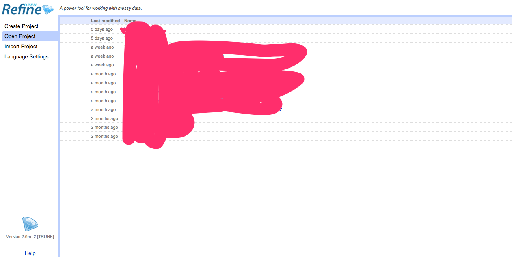

### Getting the sample data

Imagine yourself as a curator in a museum.

Yup, we will work using the sample data of a museum inventory from the Powerhouse museum in sydney. The data is freely available as an open data. You can see the full version of the data here [http://www.powerhousemuseum.com/collection/database/download.php](http://www.powerhousemuseum.com/collection/database/download.php)

However, the powerhouse museum data is very large (we're talking about 100+K rows of data here) and we will work with a subset of the data, which you can download here [https://docs.google.com/spreadsheets/d/1I2I0iWRbOI9iIqVTME5pcti4p0PTDSfExiiqJcs-1I4/edit?usp=sharing](https://docs.google.com/spreadsheets/d/1I2I0iWRbOI9iIqVTME5pcti4p0PTDSfExiiqJcs-1I4/edit?usp=sharing)

You will see the data as a google sheet document. Download the data as CSV with the instructions below :

- click on "File" menu in the menu bar on the top
- hover on the "Download" menu and choose "comma separated value, CSV" file
- save the file on your computer and take note where it is

### Creating a project in Open Refine

Make sure the Open Refine has opened and you're seeing the main screen

- Click on the create project
- Choose from file and select the file CSV file of the powerhouse museum that you just downloaded.
- You will be presented with a parsing options screen. Make sure CSV is selected as the file type and the separator (comma)
- Enter the project name in the top right (Resbaz Melbourne DA Project) and create project
- Congratulations ! You have created a project in Open Refine !

Next: [Basic interface of Open Refine](open-refine-03-interface.html)

Prev: [Open Refine Introduction](open-refine-01-intro.html)

[Main menu](index.html)
